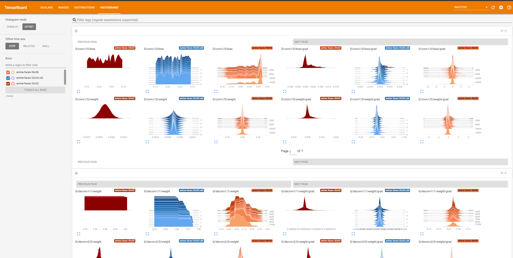
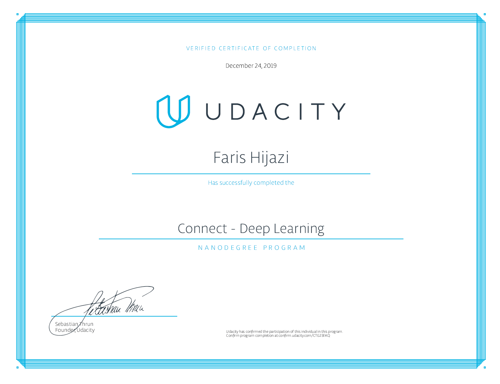

# Face generation: Generates faces of people or Anime characters using [Generative Adverserial Networks (GANs)](https://en.wikipedia.org/wiki/Generative_adversarial_network)

**Author: Faris Hijazi**

Making fake waifus because waifus are not real );

This is a fork of the [Udacity deep learning with Pytorch nanodegree](https://www.udacity.com/course/deep-learning-pytorch--ud188) [DCGAN face generation project](https://github.com/udacity/deep-learning-v2-pytorch/tree/master/project-face-generation).

However some heavy modifictions and **updgrades** have been made, such as extending the GANs and adding support for checkpoints as well as connecting with [Tensorboard](https://www.tensorflow.org/tensorboard)

In this project. The goal is to get a generator network to generate *new* images of faces that look as realistic as possible.

## Data

The dataset used was the [Anime-Face-Dataset](https://github.com/Mckinsey666/Anime-Face-Dataset).  
However any simple dataset can be used such as the [Celeba dataset](http://mmlab.ie.cuhk.edu.hk/projects/CelebA.html).

## Todo list

- [x] automate the creation of neural networks given depth parameter
- [x] connect to tensorboard
- [ ] add attention maps
- [ ] use labels to improve training

## Some resources

- [self attention GAN in PyTorch](https://github.com/heykeetae/Self-Attention-GAN)
- [gan hacks and tips](https://github.com/soumith/ganhacks)
- [batch norm](https://gist.github.com/shagunsodhani/4441216a298df0fe6ab0)
- [CVPR 2018 Tutorial on GANs](https://sites.google.com/view/cvpr2018tutorialongans/)
- [auxiliary classifier GAN ac gan from scratch with keras](https://machinelearningmastery.com/how-to-develop-an-auxiliary-classifier-gan-ac-gan-from-scratch-with-keras/)

## Results

Example of human faces:

Progress during training (epochs 0 to 29):

64x64 Generated samples after 20 epochs. Training time: ~5 hours on x2 GTX 1080-Ti GPUs

.png)

96x96 Generated samples after 45 epochs. Training time: ~20 hours on x2 GTX 1080-Ti GPUs

.png)

## [Tensorboard](https://www.tensorflow.org/tensorboard)

A lot of work was put into the checkpointing system and logging, as well as writing to tensorboard.

Histograms of each layer and its gradient

## [Certificate to *Udacity Connect Deep Learning NanoDegree*](https://graduation.udacity.com/confirm/CTG23EKQ)

